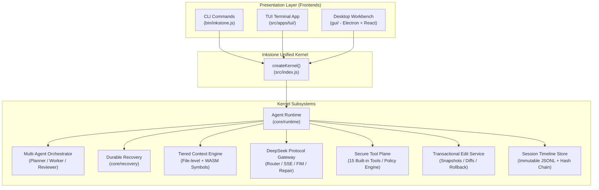

# Inkstone

<div align="center">

[简体中文](./README.md) · **English**

[](./package.json)
[](./LICENSE)
[](https://nodejs.org/)
[](./package.json)
[](./tests/)
[](https://github.com/fengzhiyushui/inkstone/pulls)

**High-Performance Local AI Coding Agent for DeepSeek Models**  
*CLI · TUI · Modern Desktop GUI — One Unified Kernel, Three Experiences*

</div>

> ⚠️ **Disclaimer:** This is an **unofficial** third-party open-source project. "DeepSeek" is a trademark of its respective owner; the name is used here only to describe native model compatibility.

---

## 📖 Table of Contents

- [1. Project Overview](#-project-overview)
  - [Why Inkstone?](#why-inkstone)
  - [The Three Core Pillars](#the-three-core-pillars)
  - [The Three-Interface Matrix](#the-three-interface-matrix)
- [2. System Architecture](#-system-architecture)
- [3. Quick Start](#-quick-start)
- [4. Local Deployment & In-Depth Guide](#-local-deployment--in-depth-guide)
- [5. Common Commands & Workflows](#-common-commands--workflows)
- [6. Model Configuration & Endpoints](#-model-configuration--endpoints)
- [7. Repository Structure](#-repository-structure)
- [8. Guardrails & Security Architecture](#-guardrails--security-architecture)
- [9. Quality Gates & Contributing](#-quality-gates--contributing)
- [10. Roadmap & Changelog](#-roadmap--changelog)
- [11. License](#-license)

---

## 💡 Project Overview

**Inkstone** is an autonomous local coding agent tailored specifically for the DeepSeek model family. Running directly inside your local repository, it goes far beyond a simple chat assistant: it can **read code, safely modify files, run tests, decompose complex engineering tasks, and coordinate multi-agent workflows**.

Every model invocation, tool execution, file modification, and human approval is immutably logged into a hash-chained session timeline, enabling **instant atomic rollbacks, turn-level branching, and crash-resilient durable recovery**.

### Why Inkstone?

- 🚀 **Zero Runtime Dependencies**: The core CLI and TUI are built entirely on native Node.js 20+ APIs with zero external production dependencies. Clone and run immediately.
- 🏛️ **True "One Kernel, Three Frontends"**: CLI, TUI, and Desktop GUI are unified over a single facade `createKernel()`, sharing 100% of runtime logic, tool executors, transactional edit services, and session state.
- 🛡️ **Transactional Edits & Rollback**: Every file modification is preceded by a state snapshot and assigned a unique Change ID. Any change can be reverted atomically with a single command.
- ⚡ **DeepSeek-Native Integration**: Tailored for DeepSeek V3 and R1 models, featuring purpose-routed model lanes, chain-of-thought visualization, FIM code completion, SSE streaming, and self-repairing JSON-mode tool calls.
- 🤝 **Adaptive Multi-Agent Collaboration**: Simple prompts execute in a lightweight single-agent flow; complex multi-file engineering tasks are automatically decomposed into a subtask tree, executed by workers in parallel write-isolated sandboxes, verified by independent reviewers, and synthesized into a final delivery report.

---

### The Three Core Pillars

```text
┌────────────────────────────────────────────────────────────────────────┐
│                        Inkstone Core Pillars                           │
├───────────────────┬──────────────────────────┬─────────────────────────┤
│ ① Context Engine  │ ② Multi-Agent Dispatch   │ ③ Frontend Matrix       │
├───────────────────┼──────────────────────────┼─────────────────────────┤
│ • File-level scan │ • Tiered decision router │ • CLI: Script automation│
│ • Token budget    │ • Subtask tree planning  │ • TUI: Keyboard terminal│
│ • WASM AST symbol │ • Parallel write sandbox │ • GUI: Modern VS Code-  │
│ • Graph expansion │ • Two-tier verification  │   style desktop app     │
└───────────────────┴──────────────────────────┴─────────────────────────┘
```

1. **Pillar ① Intelligent Context Engine**:
   - **File-level (default)**: Incremental scanning, manifest caching, path-priority ranking, and token-budget greedy packing.
   - **Semantic-level (optional, `--semantic-context`)**: WebAssembly-powered tree-sitter AST parser (no native C++ build required) extracting function, class, and interface symbols across **JavaScript / TypeScript / Python**, with dependency graph expansion.
2. **Pillar ② Multi-Agent Adaptive Orchestration**:
   - The kernel detects task complexity automatically—no manual mode switching needed.
   - The Planner constructs a subtask dependency tree; Workers execute subtasks in file-isolated sandbox directories and merge back atomically using CAS consistency checks.
   - An independent read-only Reviewer inspects all worker outputs, triggering replanning upon detecting regressions.
3. **Pillar ③ Unified Frontend Matrix**:
   - **CLI**: Streamlined for one-off tasks, patch generation, workspace scanning, and CI/CD pipelines.
   - **TUI**: Claude Code-inspired scrollable terminal interface with hand-crafted ANSI/VT rendering, slash commands, and real-time approval cards.
   - **GUI (v1.8)**: An original VS Code-style three-column desktop IDE built with Electron, React 19, Vite, Monaco Editor, interactive system terminal, and SCM visual diff inspector.

---

### The Three-Interface Matrix

| Interface | Best For | Prerequisites | Key Highlights |
|:---|:---|:---|:---|
| **CLI** | Scripting, single questions, automated refactors | Node.js ≥ 20 (0 extra dependencies) | Clean output, composable via pipes, forwards project test exit codes |
| **TUI** | Keyboard-centric developers, remote SSH servers | Node.js ≥ 20 (0 extra dependencies) | Native scrollback buffer, typewriter streaming, approval prompts, slash commands |
| **Desktop GUI** | Codebase browsing, visual diff reviews, full IDE flow | Electron + React 19 | Three-column workspace, Monaco editor, side-by-side diff review, embedded terminal |

---

## 🏗️ System Architecture



---

## 🚀 Quick Start

### Prerequisites
- **Node.js**: `>= 20.0.0`
- **Operating System**: Windows, macOS, or Linux

### 3-Step Quick Start (CLI / TUI, No Install Needed)

```bash
# 1. Clone the repository
git clone https://github.com/fengzhiyushui/inkstone.git
cd inkstone

# 2. Configure your DeepSeek API Key (writes to .deepseek-code/config.json)
node ./bin/inkstone.js config init --api-key sk-your-api-key
# Or set via environment variable: export DEEPSEEK_API_KEY="sk-your-api-key"

# 3. Start exploring!
node ./bin/inkstone.js ask "Explain the architecture of this project"
node ./bin/inkstone.js tui
```

> 💡 **Global Shortcuts**: Run `npm link` or `npm install -g .` to use `inkstone` or the shorthand `dsc` anywhere on your machine.

---

## 📚 Local Deployment & In-Depth Guide

For detailed walkthroughs covering production desktop builds, AST symbol engine setup, and advanced workflows:

👉 **[📖 Read the Full Local Deployment & Usage Guide (docs/DEPLOYMENT_AND_USAGE.md)](docs/DEPLOYMENT_AND_USAGE.md)**

### Deployment Options Summary

- **Option A: Instant CLI / TUI**: Zero runtime dependencies, run straight with Node.js 20+.
- **Option B: Semantic AST Context Engine**: Install optional WASM package `npm install web-tree-sitter@0.20.8 --no-save`, then add `--semantic-context`.
- **Option C: Desktop GUI Setup**:
  ```bash
  cd gui
  npm install
  npm run build:renderer
  npm start               # Launch production desktop app
  # npm run dev           # Start Vite hot-reload development mode
  ```

---

## 🧭 Common Commands & Workflows

| Command | Example | Description |
|:---|:---|:---|
| **`ask`** | `inkstone ask "Explain auth flow" --semantic-context` | Ask a contextual question; supports AST symbol retrieval |
| **`chat`** | `inkstone chat` | Interactive REPL session; `/mode` switches autonomy, `/recovery` resumes turns |
| **`edit`** | `inkstone edit "Refactor logging" --dry-run` | Generate and apply patches; `--dry-run` previews diffs, `--yes` auto-applies |
| **`changes`**| `inkstone changes list` / `show latest` | Inspect past change records and their unified diffs |
| **`rollback`**| `inkstone rollback latest` | Atomically undo changes back to a specific Change ID |
| **`diff`** | `inkstone diff` | View git diffs within the current workspace |
| **`test`** | `inkstone test [args...]` | Run your project's test suite and forward exit codes |
| **`scan`** | `inkstone scan` | Scan workspace source files and print token budget allocation |
| **`search`**| `inkstone search "createKernel" --max 50` | Search codebase safely without executing external grep binaries |
| **`config`**| `inkstone config show` / `init` / `test` | Inspect configuration / initialize credentials / test connection |
| **`tui`** | `inkstone tui` | Launch the full-featured interactive terminal coding agent |

---

## ⚙️ Model Configuration & Endpoints

Inkstone loads configuration from `./.deepseek-code/config.json` (gitignored) and falls back to user-level `~/.deepseek-code/config.json`.

### Environment Variables

| Variable | Default | Description |
|:---|:---|:---|
| `DEEPSEEK_API_KEY` | — | DeepSeek API authentication key |
| `DEEPSEEK_BASE_URL` | `https://api.deepseek.com` | Base endpoint URL (compatible with Ollama/vLLM) |
| `DEEPSEEK_MODEL` | `deepseek-v4-flash` | Default model for conversations and tool actions |
| `DEEPSEEK_REASONING_EFFORT` | `high` | Thinking model reasoning intensity (`low` / `medium` / `high`) |
| `DEEPSEEK_TOOL_TIMEOUT_MS` | `120000` (120s) | Execution timeout per tool call |
| `DEEPSEEK_MODEL_TIMEOUT_MS` | `120000` (120s) | Request & streaming timeout per model call |

### Custom Endpoints (Ollama / vLLM / OpenRouter)

Inkstone works out of the box with any OpenAI / DeepSeek-compatible endpoint:

```json
{
  "apiKey": "ollama",
  "baseUrl": "http://localhost:11434/v1",
  "model": "deepseek-coder-v2:latest",
  "models": {
    "act": "deepseek-coder-v2:latest",
    "think": "deepseek-r1:latest",
    "fim": "deepseek-coder-v2:latest"
  }
}
```

See [Deployment Guide §3](docs/DEPLOYMENT_AND_USAGE.md#三模型配置与接入指南) for additional options and guardrails.

---

## 📂 Repository Structure

```text
inkstone/
├── bin/
│   └── inkstone.js           # CLI / TUI entrypoint
├── src/                      # Core runtime and kernel implementation
│   ├── index.js              # createKernel() composition root
│   ├── core/                 # Runtime lifecycle, orchestration, protocol, recovery
│   ├── context/              # Context engine (file scans, caching, WASM AST parser)
│   ├── deepseek/             # DeepSeek gateway (routing, streaming, FIM, repair)
│   ├── tools/                # Tool registry, permission engine, 15 built-in tools
│   ├── edits/                # Transactional editing, diff parser, atomic rollback
│   ├── sessions/             # Immutable session event log, branching, rewinding
│   ├── security/             # SSRF prevention, shell command safety, redactions
│   └── apps/                 # CLI / TUI adapters and GUI kernel host
├── gui/                      # Desktop GUI application (Electron + React 19 + Vite)
│   ├── main.js               # Electron main process
│   ├── preload.js            # Sandboxed preload bridge
│   └── src/                  # React UI (AppFrame, Dock, Monaco, SCM, Chat)
├── docs/                     # Documentation center
│   ├── DEPLOYMENT_AND_USAGE.md # Local deployment & usage manual
│   ├── project-overview.md   # Deep architectural specification
│   └── CHANGELOG.md          # Release history
└── tests/                    # Comprehensive test suite (1140+ unit & E2E tests)
```

---

## 🛡️ Guardrails & Security Architecture

Security is central to local agent design:

1. **Path Boundary Defense**: All workspace path interactions are validated using `realpath`, strictly preventing path traversal and symlink escapes.
2. **Command Policy & Whitelists**:
   - `shell: true` is forbidden; subprocesses execute via structured argv arrays.
   - Destructive operations (`mkfs`, `diskpart`, `dd`, etc.) are unconditionally rejected.
   - Dangerous commands require explicit user approval in all permission modes.
3. **SSRF Guard**: The `web_fetch` tool blocks localhost, private LAN ranges, and IPv6 literals across all redirect hops.
4. **Secret Masking & UI Sandboxing**: Secrets are automatically redacted from logs. The Desktop GUI runs in a sandboxed Electron renderer with context isolation; plain text API keys never cross IPC to the renderer.
5. **Resource Guardrails**: Hard limits on tool execution timeouts, model latency, turn tokens, and model calls prevent runaway cost and hanging processes.

---

## 🧪 Quality Gates & Contributing

Contributions are welcome! To safeguard stability, Inkstone enforces strict **Five Quality Gates**:

```bash
# 1. Run full unit and integration test suite (1141 tests all green)
npm test

# 2. Syntax and type check across all source files
npm run check

# 3. GUI renderer builds cleanly with zero errors
cd gui && npm run build:renderer

# 4. GUI end-to-end smoke tests pass
DEEPSEEK_CODE_GUI_SMOKE=1 node --test tests/e2e/gui-smoke.test.js

# 5. Eight-directory lock integrity check (ensures core contracts remain pristine)
git diff --stat main..HEAD -- src/core src/deepseek src/tools src/edits src/sessions src/context src/security src/workspace
```

---

## 🗺️ Roadmap & Changelog

- [x] **v1.0.0**: Unified kernel foundation, three frontends sharing one runtime, transactional rollback.
- [x] **v1.2.0**: Tool security hardening, environment whitelists, cooperative grep timeouts.
- [x] **v1.4.0**: Tiered context engine, multi-agent orchestration, parallel write sandboxing.
- [x] **v1.8.0**: Modern three-column desktop workbench redesign, Monaco integration, profile switcher.
- [x] **v1.8.3**: Comprehensive GUI code review, state synchronization fixes, deployment documentation.
- [ ] **Future**: Plugin extension ecosystem, additional language AST support, collaborative multi-device agents.

See [**`docs/CHANGELOG.md`**](docs/CHANGELOG.md) for detailed release notes.

---

## 📄 License

This project is licensed under the [Apache-2.0 License](LICENSE).
