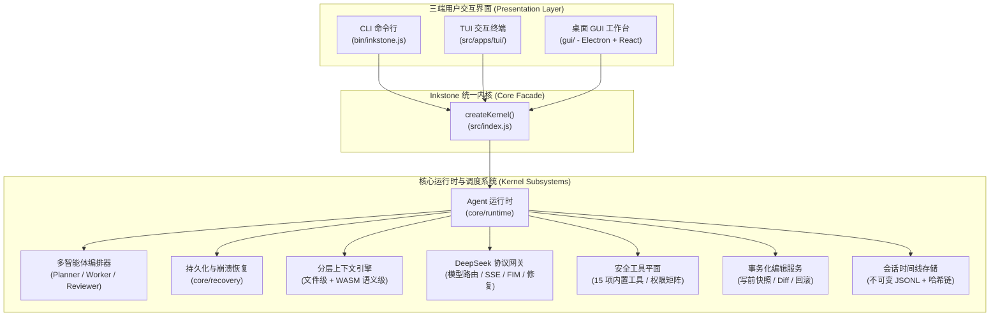

# Inkstone (砚台)

<div align="center">

**简体中文** · [English](./README.en.md)

[](./package.json)
[](./LICENSE)
[](https://nodejs.org/)
[](./package.json)
[](./tests/)
[](https://github.com/fengzhiyushui/inkstone/pulls)

**面向 DeepSeek 模型的高性能本地 AI 编程智能体 (Coding Agent)**  
*CLI · TUI · 现代化桌面 GUI —— 一套内核，三端体验*

</div>

> ⚠️ **声明**：本项目为**非官方**第三方开源项目。"DeepSeek" 为其所有者商标，本项目仅在描述"原生适配该模型"的意义上使用该名称。

---

## 📖 目录

- [一、项目介绍](#-项目介绍)
  - [为什么选择 Inkstone？](#为什么选择-inkstone)
  - [核心三支柱体系](#核心三支柱体系)
  - [三端交互矩阵](#三端交互矩阵)
- [二、架构全景](#-架构全景)
- [三、快速开始](#-快速开始)
- [四、本地部署与详细教程](#-本地部署与详细教程)
- [五、常用命令与工作流速查](#-常用命令与工作流速查)
- [六、模型接入与配置指南](#-模型接入与配置指南)
- [七、项目结构与目录导航](#-项目结构与目录导航)
- [八、运行护栏与安全架构](#-运行护栏与安全架构)
- [九、质量准入与贡献指南](#-质量准入与贡献指南)
- [十、路线图与变更日志](#-路线图与变更日志)
- [十一、许可证](#-许可证)

---

## 💡 项目介绍

**Inkstone（砚台）** 是一个专门面向 DeepSeek 模型家族设计的本地自主编程 Agent。它直接在你的工程目录内运行：不仅能理解代码、回答架构问题，更能**安全编辑代码、运行测试、拆解复杂工程任务并执行多智能体协作**。

每一次模型调用、工具执行、代码变动和审批都会作为不可变事件记录在具备哈希链的会话时间线中，支持**秒级原子回滚、多分支分叉与崩溃断点持久化恢复**。

### 为什么选择 Inkstone？

- 🚀 **核心运行时零依赖（Zero Runtime Dependencies）**：CLI 与 TUI 完全基于 Node.js 20+ 原生标准库构建，无需繁琐的包安装，克隆即可运行。
- 🏛️ **真正的「一核三端」架构**：CLI、TUI 和现代桌面 GUI 统一构建在同一个内核门面 `createKernel()` 之上，业务逻辑、工具链、编辑服务和会话状态 100% 共享一致。
- 🛡️ **工程级安全与事务性回滚**：所有文件变更前均自动创建状态快照，生成唯一 Change ID，支持一键原子撤销，杜绝代码污染。
- ⚡ **DeepSeek 原生全协议适配**：深度结合 DeepSeek V3 / R1 模型特性，支持基于用途的自动模型路由、思考链可视化、FIM 代码光标补全、手写 SSE 流式传输与 JSON Mode 格式容错修复。
- 🤝 **自适应多智能体协作**：简单任务单智能体零开销秒级响应；复杂任务自动由 Planner 拆解为子任务树，Worker 在临时文件沙箱中并行写隔离，配合两级 Reviewer 独立校验与 Synthesizer 合成。

---

### 核心三支柱体系

```text
┌────────────────────────────────────────────────────────────────────────┐
│                        Inkstone 三大核心支柱                           │
├───────────────────┬──────────────────────────┬─────────────────────────┤
│ ① 上下文引擎      │ ② 多智能体自适应编排     │ ③ 三端交互形态          │
├───────────────────┼──────────────────────────┼─────────────────────────┤
│ • 文件级增量索引  │ • 确定性与模型分层路由器 │ • CLI: 自动化脚本集成   │
│ • 动态 Token 预算 │ • Planner 拆解子任务树   │ • TUI: 键盘流滚动终端   │
│ • WASM 语义符号   │ • 临时工作区并行写隔离   │ • GUI: VS Code 风格桌面 │
│ • 依赖调用图扩展  │ • 两级独立审核与自修复   │ • 原创设计系统，非成品套│
└───────────────────┴──────────────────────────┴─────────────────────────┘
```

1. **支柱 ① 智能上下文引擎**：
   - **文件级（默认）**：增量扫描、manifest 缓存、路径优先级排序、按通道 Token 预算贪心装填。
   - **语义级（可选，`--semantic-context`）**：基于 WebAssembly 运行的 tree-sitter 解析器（无需本地 C++ 构建），精确提取 **JavaScript / TypeScript / Python** 的函数、类与接口符号，沿 import 与调用图向上展开，实现代码精确定位。
2. **支柱 ② 多智能体自适应编排**：
   - 内核自动判断任务复杂度，无需用户手动指定模式。
   - Planner 制定执行计划，Worker 在文件系统隔离区并行开发，通过快照一致性 CAS 校验原子合并回工作区。
   - 独创只读 Reviewer 独立校验，出现回归时自动触发重规划（Replanning）。
3. **支柱 ③ 统一体验的三端矩阵**：
   - **CLI**：用于一次性提问、补丁生成、代码扫描与 CI/CD 自动化集成。
   - **TUI**：类 Claude Code 设计的高效滚动终端，手写 ANSI/VT 渲染，支持丰富快捷键与 Slash 命令。
   - **GUI (v1.8)**：基于 Electron + React 19 + Vite 的原创桌面工作台，集成 Monaco 编辑器、双栏 SCM Diff 对比、多功能右栏 Dock（文件/改动/计划/恢复）与全功能设置面板。

---

### 三端交互矩阵

| 交互形态 | 典型使用场景 | 依赖条件 | 交互亮点 |
|:---|:---|:---|:---|
| **CLI** | 脚本集成、单次问答、代码批量重构 | Node.js ≥ 20（零额外依赖） | 简洁输出、可管道组合、透传项目测试退出码 |
| **TUI** | 全键盘开发者、远程 SSH 终端开发 | Node.js ≥ 20（零额外依赖） | 原生滚动区、实时流式打字卡片、交互式审批、Slash 命令 |
| **桌面 GUI** | 复杂工程浏览、可视化代码审核、综合工作台体验 | Electron + React 19 | 现代工作台、Monaco 编辑器、可视化行级 Diff 审查、多功能右栏 Dock |

---

## 🏗️ 架构全景



---

## 🚀 快速开始

### 运行环境要求
- **Node.js**：`>= 20.0.0`
- **操作系统**：Windows、macOS 或 Linux

### 3 步极速上手（CLI / TUI，无需安装依赖）

```bash
# 1. 克隆代码仓库
git clone https://github.com/fengzhiyushui/inkstone.git
cd inkstone

# 2. 初始化配置 DeepSeek API Key（写入 .deepseek-code/config.json）
node ./bin/inkstone.js config init --api-key sk-your-api-key
# 或者直接导出环境变量：export DEEPSEEK_API_KEY="sk-your-api-key"

# 3. 运行体验！
node ./bin/inkstone.js ask "梳理这个项目的核心架构"
node ./bin/inkstone.js tui
```

> 💡 **全局命令提示**：执行 `npm link` 或 `npm install -g .` 后，可以直接在任意项目中使用 `inkstone` 或简写 `dsc`。

---

## 📚 本地部署与详细教程

为了让开发者能够深度掌握不同场景下的部署方法与功能实操，我们编写了完整的指南：

👉 **[📖 点击阅读《Inkstone 本地部署与使用完整指南》(docs/DEPLOYMENT_AND_USAGE.md)](docs/DEPLOYMENT_AND_USAGE.md)**

### 本地部署模式摘要

- **模式 1：CLI / TUI 极速部署**：核心运行时 0 额外生产依赖，开箱即用。
- **模式 2：启用语义 AST 符号解析**：在项目根目录下安装可选 WASM 依赖 `npm install web-tree-sitter@0.20.8 --no-save`，使用时追加 `--semantic-context`。
- **模式 3：桌面 GUI 完整运行**：
  ```bash
  cd gui
  npm install
  npm run build:renderer
  npm start               # 启动桌面工作台
  # npm run dev           # 开发热重载模式
  ```

---

## 🧭 常用命令与工作流速查

| 命令 | 示例 | 功能说明 |
|:---|:---|:---|
| **`ask`** | `inkstone ask "说明认证流程" --semantic-context` | 基于项目上下文回答问题，支持语义级符号索引检索 |
| **`chat`** | `inkstone chat` | 进入终端连续对话，支持 `/mode` 切换权限、`/recovery` 恢复会话 |
| **`edit`** | `inkstone edit "重构日志格式" --dry-run` | 生成并应用事务性补丁；`--dry-run` 预览，`--yes` 免确认应用 |
| **`changes`**| `inkstone changes list` / `show latest` | 查看历史 Agent 修改列表与每次修改的具体 Unified Diff |
| **`rollback`**| `inkstone rollback latest` | 将代码工作区原子回滚到指定 Change ID 或最近一次变更前 |
| **`diff`** | `inkstone diff` | 快速查看当前工作区与 Git 版本的差异 |
| **`test`** | `inkstone test [参数...]` | 执行当前目标项目的测试套件，并如实透传退出码 |
| **`scan`** | `inkstone scan` | 扫描工作区有效源码并打印 Token 预算占用分布 |
| **`search`**| `inkstone search "createKernel" --max 50` | 在工作区源码中进行安全文本检索 |
| **`config`**| `inkstone config show` / `init` / `test` | 查看当前生效配置 / 初始化配置 / 测试 API 连通性 |
| **`tui`** | `inkstone tui` | 打开基于终端的全功能交互式 Coding Agent 界面 |

---

## ⚙️ 模型接入与配置指南

Inkstone 支持项目级配置文件与系统环境变量。配置文件存储于工作区根目录的 `./.deepseek-code/config.json`（已被 `.gitignore` 保护）。

### 核心环境变量

| 环境变量 | 默认值 | 作用说明 |
|:---|:---|:---|
| `DEEPSEEK_API_KEY` | — | DeepSeek API 鉴权密钥 |
| `DEEPSEEK_BASE_URL` | `https://api.deepseek.com` | API 服务端点（支持兼容端点如 Ollama/vLLM） |
| `DEEPSEEK_MODEL` | `deepseek-flash` | 默认对话与工具调用模型 |
| `DEEPSEEK_REASONING_EFFORT` | `high` | 思考模型推理强度（`low` / `medium` / `high`） |
| `DEEPSEEK_TOOL_TIMEOUT_MS` | `120000` (120s) | 单次工具执行超时阈值 |
| `DEEPSEEK_MODEL_TIMEOUT_MS` | `120000` (120s) | 模型请求与流式传输超时阈值 |

### 第三方与本地端点支持

Inkstone 原生支持任何兼容 OpenAI / DeepSeek 规范的 API 服务（如 **Ollama、vLLM、OpenRouter、硅基流动、OneAPI** 等）：

```json
{
  "apiKey": "ollama",
  "baseUrl": "http://localhost:11434/v1",
  "model": "deepseek-coder-v2:latest",
  "models": {
    "act": "deepseek-coder-v2:latest",
    "think": "deepseek-r1:latest",
    "fim": "deepseek-coder-v2:latest"
  }
}
```

更多配置详情与运行护栏设置请查阅 [详细部署指南配置小节](docs/DEPLOYMENT_AND_USAGE.md#三模型配置与接入指南)。

---

## 📂 项目结构与目录导航

```text
inkstone/
├── bin/
│   └── inkstone.js           # CLI / TUI 入口执行脚本
├── src/                      # 内核核心实现
│   ├── index.js              # createKernel() 组合根入口
│   ├── core/                 # 核心运行时 (Runtime, Orchestration, Recovery, Protocol)
│   ├── context/              # 上下文引擎 (Manifest, Cache, WASM Tree-sitter)
│   ├── deepseek/             # DeepSeek 协议网关 (Router, Streaming, FIM, Repair)
│   ├── tools/                # 工具注册表、权限引擎与 15 个内置安全工具
│   ├── edits/                # 事务化编辑、Diff 解析与原子回滚服务
│   ├── sessions/             # 会话事件时间线、分支与 Checkpoint Rewind
│   ├── security/             # SSRF 拦截、Shell 策略与敏感词脱敏
│   └── apps/                 # CLI / TUI 展现层与 GUI 宿主对接适配
├── gui/                      # 桌面 GUI 应用 (Electron + React 19 + Vite)
│   ├── main.js               # Electron 主进程
│   ├── preload.js            # 安全沙箱 Preload 脚本
│   └── src/                  # React 前端 (AppFrame, Dock, Monaco, SCM, Chat)
├── docs/                     # 完整项目文档中心
│   ├── DEPLOYMENT_AND_USAGE.md # 本地部署与使用完整手册
│   ├── project-overview.md   # 深入技术架构说明
│   └── CHANGELOG.md          # 版本发布日志
└── tests/                    # 完整自动化测试套件 (1140+ 项用例)
```

---

## 🛡️ 运行护栏与安全架构

安全是本地编程智能体的生命线。Inkstone 在架构层建立了多重刚性安全机制：

1. **路径穿越防御**：所有工作区文件读写均经过 `realpath` 严格归一化校验，坚决阻断符号链接逃逸（Symlink Escape）。
2. **命令执行白名单与安全分类**：
   - 绝不使用不受控的 `shell: true`，所有外部进程均以结构化 argv 安全执行。
   - 破坏性命令（如 `mkfs`, `diskpart`, `dd` 等）硬编码绝对禁止。
   - 危险操作（如文件批量删除、强推 Git 等）在所有权限模式下一律要求用户显式审批。
3. **SSRF 网络防御**：内置 `web_fetch` 工具强行封锁本地回环（`localhost`、`127.0.0.1`）、内网保留地址段与 IPv6 变形地址，且每跳 HTTP 重定向均重新做地址解析校验。
4. **敏感凭据脱敏**：工具输出与日志中自动识别并掩蔽 API Key、Bearer Token，桌面 GUI 渲染进程采用全沙箱隔离，绝不向视图层传递明文密钥。
5. **运行资源护栏**：超时、Token 上限与模型调用次数超限时优雅停止，坚决避免死循环与 API 额度浪费。

---

## 🧪 质量准入与贡献指南

我们非常欢迎社区贡献！为了保证内核的绝对稳定，Inkstone 实行严格的**五项准入测试闸门（Five Gates）**：

```bash
# 1. 运行全部单元与集成测试套件（当前 1141 项测试全绿）
npm test

# 2. 源码语法校验
npm run check

# 3. 桌面 GUI 渲染层构建零错误
cd gui && npm run build:renderer

# 4. GUI 端到端冒烟测试
DEEPSEEK_CODE_GUI_SMOKE=1 node --test tests/e2e/gui-smoke.test.js

# 5. 核心八目录锁完整性校验（确保外部重构不破坏核心契约）
git diff --stat main..HEAD -- src/core src/deepseek src/tools src/edits src/sessions src/context src/security src/workspace
```

### 贡献规范
1. Fork 本仓库并基于功能建立新分支。
2. 遵循代码风格，确保修改不违反八目录锁与安全规范。
3. 补充相应的测试用例，并确保 `npm test` 与 `npm run check` 100% 通过。
4. 提交清晰规范的 Commit Message。

---

## 🗺️ 路线图与变更日志

- [x] **v1.0.0**：统一内核奠基，一核驱动三端，事务化编辑与回滚。
- [x] **v1.2.0**：工具平面安全加固，白名单环境继承，协作式超时。
- [x] **v1.4.0**：智能上下文引擎，多智能体分层编排与并行写隔离。
- [x] **v1.8.0**：桌面 GUI 现代三栏式重构，双向把手折叠，Monaco 深度集成与多 Profile 切换。
- [x] **v1.8.3**：GUI 深度代码审查与缺陷修复，状态同步强固，全套部署使用指南发布。
- [x] **v1.8.4**：前端布局工效重构与遥测体系落地（Rail 零抖动平滑开合、消息与 Composer 双遥测、原创高对比调色板与 Plan 专属面板）。
- [ ] **未来规划**：支持插件扩展体系、更多语言语义分析适配、团队多端协作能力。

完整版本历史见 [**`docs/CHANGELOG.md`**](docs/CHANGELOG.md)。

---

## 📄 许可证

本项目基于 [Apache-2.0 License](LICENSE) 协议开源。
