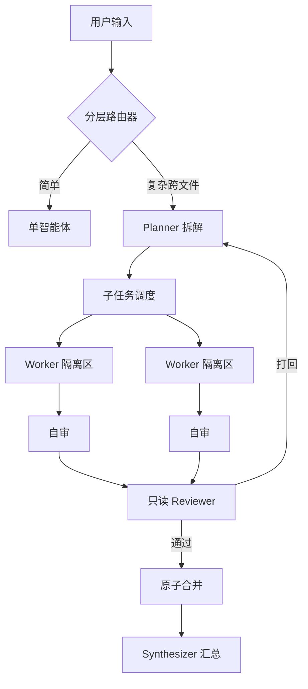

# Inkstone 本地部署与使用指南

Inkstone（砚台）的本地部署、模型配置、CLI / TUI / 桌面 GUI 用法与排错说明。

---

## 环境要求

| 项 | 要求 |
|----|------|
| 操作系统 | Windows 10/11（x64、ARM64）、macOS 11+（Intel / Apple Silicon）、Ubuntu 20.04+ / Debian 11+ / Fedora 36+ / Arch 等 |
| Node.js | **≥ 20**（推荐 20 LTS 或 22 LTS） |
| Git | ≥ 2.30（推荐，用于 diff 与版本管理） |
| C/C++ 工具链 | 不需要。核心与 TUI 基于 Node 标准库；语义引擎用 WASM |

```bash
node --version   # 应 ≥ v20
```

---

## 部署

### CLI / TUI（核心零依赖）

内核与 CLI / TUI 无外部生产依赖，克隆后可直接运行，不必 `npm install`。

```bash
git clone https://github.com/fengzhiyushui/inkstone.git
cd inkstone

node ./bin/inkstone.js help

# 可选：全局注册 inkstone / dsc
npm link
# 或
npm i -g .

inkstone --help
dsc --help
```

### 语义级上下文引擎（可选 WASM）

默认使用文件级上下文。需要对 JS / TS / Python 做 AST 符号与调用图分析时，再装可选依赖：

```bash
npm install web-tree-sitter@0.20.8 --no-save

node ./bin/inkstone.js ask "解释项目核心流程" --semantic-context
```

关闭 `--semantic-context` 时行为与文件级一致。该依赖是纯 WASM，无需本地编译器。

### 桌面 GUI（Electron + React）

GUI 需要单独安装依赖并构建渲染层。

```bash
cd gui
npm install
npm run build:renderer

# 生产模式
npm start

# 开发模式（热重载）
npm run dev
```

根目录也可：

```bash
npm run build:gui
npm run gui
```

GUI 提供会话优先工作台、Monaco 只读 Diff、改动跟踪、右栏 Dock（计划 / 文件 / 改动 / 恢复）与设置模态。

---

## 模型配置

配置查找顺序（高优先覆盖低优先）：

1. 环境变量
2. 项目级 `./.deepseek-code/config.json`
3. 用户级 `~/.deepseek-code/config.json`

`.deepseek-code/` 已被 `.gitignore` 忽略，API Key 不会进 Git。

### DeepSeek 官方 API

```bash
# 交互初始化（推荐）
node ./bin/inkstone.js config init --api-key sk-your-deepseek-api-key
```

或用环境变量：

```bash
# bash / zsh
export DEEPSEEK_API_KEY="sk-your-deepseek-api-key"

# PowerShell
$env:DEEPSEEK_API_KEY="sk-your-deepseek-api-key"

# CMD
set DEEPSEEK_API_KEY=sk-your-deepseek-api-key
```

连通性检查：

```bash
node ./bin/inkstone.js config test
# 成功时输出：API connection test succeeded.
```

### 本地与第三方兼容端点

网关兼容 OpenAI / DeepSeek 协议。指定 `baseUrl` 与模型名即可。

Ollama 示例：

```json
{
  "apiKey": "ollama",
  "baseUrl": "http://localhost:11434/v1",
  "model": "deepseek-coder-v2:latest",
  "models": {
    "act": "deepseek-coder-v2:latest",
    "think": "deepseek-r1:latest",
    "fim": "deepseek-coder-v2:latest"
  }
}
```

vLLM / LocalAI / 中转示例：

```bash
node ./bin/inkstone.js config init \
  --api-key "your-key" \
  --base-url "https://api.siliconflow.cn/v1" \
  --model "deepseek-ai/DeepSeek-V3"
```

### 配置文件结构

以 [`src/config.js`](../src/config.js) 的 `DEFAULT_CONFIG` 为准。常见字段：

```json
{
  "apiKey": "sk-********************",
  "baseUrl": "https://api.deepseek.com",
  "model": "deepseek-flash",
  "reasoningEffort": "high",
  "betaBase": "",
  "models": {
    "act": "deepseek-flash",
    "think": "deepseek-v4-pro",
    "fim": "deepseek-flash"
  },
  "limits": {
    "toolTimeoutMs": 120000,
    "modelTimeoutMs": 120000,
    "maxTurnTokens": null,
    "maxModelCalls": null,
    "maxToolCallRepairs": null
  },
  "context": {
    "semantic": {
      "enabled": false,
      "hops": 2,
      "maxSymbols": 200,
      "includeMethodHints": false,
      "importRoots": []
    }
  },
  "orchestration": {
    "maxSubtasks": 8,
    "maxWorkerAttempts": 2,
    "maxRounds": 2,
    "crossTaskLearning": "off",
    "budget": { "maxTokens": null, "maxModelCalls": 40 },
    "parallel": {
      "maxParallelWorkers": 4,
      "maxCopyFiles": 5000,
      "sweepTtlMs": 3600000
    },
    "router": {
      "minComplexFiles": 2,
      "model": {
        "enabled": true,
        "channel": "act",
        "timeoutMs": 8000,
        "maxRepairs": 1,
        "complexThreshold": 3
      }
    }
  },
  "edits": {
    "maxCaptureBytes": 1048576,
    "changeRetention": { "maxRecords": 200, "maxAgeDays": 90 }
  }
}
```

| 字段 | 含义 |
|------|------|
| `models.act` | 日常问答与工具调用（默认 `deepseek-flash`） |
| `models.think` | 规划 / 评审 / 修复（默认 `deepseek-v4-pro`） |
| `models.fim` | 光标处补全（`/beta/completions`，默认 `deepseek-flash`） |
| `reasoningEffort` | think 通道思考强度：`none` / `low` / `medium` / `high` / `max`，默认 `high`；历史版本的 low/medium 折叠为 high 已废弃 |
| `betaBase` | FIM beta 端点根地址，默认 `""` = 客户端自拼 `${baseUrl}/beta`；自建/代理网关可显式覆盖 |
| `limits` | 超时与回合预算护栏 |
| `context.semantic` | 语义上下文（默认关） |
| `orchestration` | 多智能体拆解、并行写隔离、经验学习 |
| `edits` | 变更记录截断与保留期 |
| `crossTaskLearning` | `"off"` / `"on"` / `"gated"`，默认 `"off"` |

持久化恢复不是 `config.json` 字段。启用方式是 `createKernel(root, { recovery: { enabled: true } })`（CLI/TUI 经对应入口透传；默认关闭）。

### 旧模型 id 静默迁移

`deepseek-v4-flash`（V4-Flash）已退役。旧配置（`model` / `models.*`）中若仍写着该 id，Inkstone 加载时会在内存中自动改写为 `deepseek-flash`：仅本次运行生效，不会重写 `config.json`。改写只做精确键匹配，第三方端点（Ollama / vLLM / OneAPI）的模型 id 一律原样保留，显式指定的模型 id 仍最高优先。

### thinking 与 reasoning_effort

- 通道画像由内核路由表决定：`plan` / `review` / `repair` 三个 think 通道**默认开启 thinking**（effort `high`），`reply` / `act` / `fim` 默认关闭。
- 官方协议下 **thinking 开启时 `temperature` 静默无效**——think 通道因此不传 temperature；需要调采样只能先关 thinking（配置层改变量不影响已冻硬的通道开关）。
- `reasoning_effort` 合法全集 `none` / `low` / `medium` / `high` / `max`，原样透传不做折叠；`none` 语义等价「关思考」。未识别值回落默认 `high`。
- `max_tokens`：非 thinking 默认 8K 量级、thinking 官方默认 64K（`effort=max` 时 128K），单次上限 384K；输出被截断时结果带 `truncated` 标记，可用更低的 effort 或更具体的指令重试。

### 第三方端点兼容警告

Inkstone 核心按 DeepSeek 官方协议编写。接入 **Ollama / vLLM / OneAPI / 硅基流动 / OpenRouter** 等兼容端点时，网关必须完整透传以下扩展字段，否则思考链断裂或在工具循环中直接 400：

- `thinking`（开关）与 `reasoning_effort`（强度）——OneAPI 类网关的「模型映射」重建请求体时最易吞掉；
- 历史消息的 `reasoning_content`——带 `tools` 的请求每轮必须回传；
- `prompt_cache_hit_tokens` / `prompt_cache_miss_tokens` / `completion_tokens_details.reasoning_tokens`——用量分列依赖。

现象与处置：思考不显示 → 网关吞了 `thinking`；工具循环第二轮 400 → 网关吞了 `reasoning_content`；用量缺列 → 网关重写了 usage。自建网关可用 `betaBase` 单独指定 FIM 端点根地址；无法升级网关时建议对 agent 类任务直连官方端点。

### 环境变量

| 变量 | 对应配置 | 默认 |
|------|----------|------|
| `DEEPSEEK_API_KEY` | `apiKey` | 无 |
| `DEEPSEEK_BASE_URL` | `baseUrl` | `https://api.deepseek.com` |
| `DEEPSEEK_MODEL` | `model` | `deepseek-flash` |
| `DEEPSEEK_REASONING_EFFORT` | `reasoningEffort` | `high` |
| `DEEPSEEK_TOOL_TIMEOUT_MS` | `limits.toolTimeoutMs` | `120000` |
| `DEEPSEEK_MODEL_TIMEOUT_MS` | `limits.modelTimeoutMs` | `120000` |

查看当前生效配置：

```bash
node ./bin/inkstone.js config show
```

### 运行护栏

| 参数 | 默认 | 行为 |
|------|------|------|
| `toolTimeoutMs` | 120s | 工具超时返回格式化错误，不强杀进程 |
| `modelTimeoutMs` | 120s | 覆盖流式完整传输；悬挂时中止 |
| `maxTurnTokens` | 关 | 命中后 `status: "stopped"` |
| `maxModelCalls` | 关 | 防单回合工具往返无限循环 |
| `maxToolCallRepairs` | 关 | 畸形 tool-call JSON 有界修复 |

---

## 使用教程

### CLI

适合脚本与 CI。

```bash
# 问答（项目上下文）
node ./bin/inkstone.js ask "梳理当前项目所有的 API 路由入口及鉴权机制"

# 语义级符号分析
node ./bin/inkstone.js ask "用户登录状态是如何在前端保持的？" --semantic-context

# 控制扫描预算
node ./bin/inkstone.js ask "解释核心数据模型" --max-files 50 --max-bytes 500000

# 编辑：预览 / 指定文件 / 免确认
node ./bin/inkstone.js edit "为 src/theme.js 中的高亮函数补充 JSDoc 注释" --dry-run
node ./bin/inkstone.js edit "修复内存泄漏问题" --file src/runtime.js --file src/cache.js
node ./bin/inkstone.js edit "规范化导出命名" --yes

# 交互对话
node ./bin/inkstone.js chat
# REPL 内：/mode  ·  /recovery  ·  /help

# 变更审查与回滚
node ./bin/inkstone.js changes list
node ./bin/inkstone.js changes show latest
node ./bin/inkstone.js rollback latest
node ./bin/inkstone.js rollback chg-1718291024-abc123

# 扫描与检索
node ./bin/inkstone.js scan
node ./bin/inkstone.js search "createKernel" --max 30

# 测试透传
node ./bin/inkstone.js test
node ./bin/inkstone.js test --filter=auth
```

其他命令：`help` · `diff` · `config` · `resume` · `tui`。

### TUI

行内滚动流终端界面（手写 ANSI/VT）。

```bash
node ./bin/inkstone.js tui
# 或全局
inkstone tui
```

界面要点：历史进终端原生滚动区（滚轮 / 复制 / 查找可用）；底部固定模型、模式、Token 与输入框；思考 / 工具 / Diff 分卡渲染；危险操作弹审批卡（`y` 放行，`Esc` 拒绝）。

斜杠命令：

| 命令 | 作用 |
|------|------|
| `/help` | 命令说明 |
| `/mode [read-only\|gated\|auto]` | 自主权档位 |
| `/config` | API 列表管理、连通性测试（密钥掩码） |
| `/diff` | 工作区 Git 差异 |
| `/changes` | 历史 Agent 修改 |
| `/theme` | 主题 |
| `/lang [zh\|en]` | 界面语言并持久化 |
| `/shell` | Shell 相关 |
| `/recovery` | 中断会话管理 |
| `/clear` | 清屏 |
| `/quit` / `/exit` | 退出 |

busy 态按 `Esc` 可 `interrupt()` 当前回合，保留会话。

### 桌面 GUI

```bash
cd gui && npm start
```

| 区域 | 内容 |
|------|------|
| 左侧 Rail | 视图切换（文件 / SCM / 会话等）、主题与语言、设置入口；可收放 |
| 侧栏 | 文件树、SCM「AGENT 改动」、会话历史 |
| 主区 | 会话流 + Monaco Diff |
| 右栏 Dock | 计划、文件、改动、恢复；`Ctrl/⌘+J` |
| 设置模态 | API 列表、模型获取、主题、护栏等 |

保存走事务化 `editService`，手动与 Agent 改动都有记录。

### 多智能体编排

复杂任务由分层路由器自动选择单智能体或多智能体：



要点：无依赖且文件范围不重叠的子任务可并行隔离执行后合并；Worker 自审 + 独立 Reviewer 两级审核；`crossTaskLearning` 开启后可沉淀跨任务经验。

### 事务编辑与回滚

1. 写前快照受影响文件哈希与原文。
2. Unified Diff 解析应用；失败自动撤销，不留半写文件。
3. 回滚入口：CLI `rollback`、TUI `/changes`、GUI SCM「Rollback」。
4. 验证-修复环：应用后跑语法 / 测试，失败则模型接收错误进入修复回合。

超大文件只存摘要（见 `maxCaptureBytes`）；缺 before 全文时拒绝回滚并报 `ROLLBACK_TRUNCATED`，避免误清空。

### 会话时间线与恢复

- 会话是 append-only JSONL 事件流（`SESSION_EVENT_TYPES` 共约 65 类）。可从历史回合分支或 `rewind`。
- 开启 `recovery.enabled` 后，项目锁 + 事务日志守护写状态；崩溃后可从断点续跑。默认关闭。

---

## 常见问题

**Q1：`SyntaxError: Unexpected token '?'` 等语法错误**  
需要 Node ≥ 20。检查 `node -v`，用 `nvm` / `fnm` 升到 20 或 22 LTS。

**Q2：PowerShell 提示禁止运行脚本**  
当前会话临时放行：

```powershell
Set-ExecutionPolicy -Scope Process -ExecutionPolicy Bypass
```

**Q3：`config test` 超时或 API 错误**  
核对 API Key；内网配置 `HTTP_PROXY` / `HTTPS_PROXY`；`DEEPSEEK_BASE_URL` 不要多余斜杠。

**Q4：GUI 白屏或找不到模块**  
在 `gui/` 执行过 `npm install` 与 `npm run build:renderer`；确认 Node 与 Electron 版本匹配。

**Q5：修改未生效或提示文件超出边界**  
路径安全会阻断穿越与 symlink 逃逸。被编辑文件必须在工作区内，且不能指向工作区外的链接。
