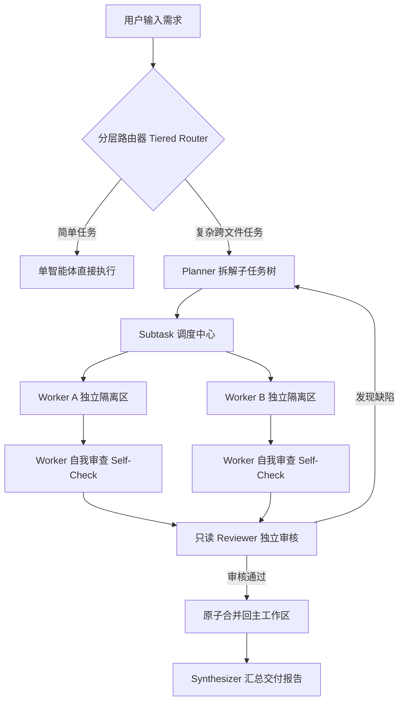

# Inkstone 本地部署与使用完整指南

本文档提供 Inkstone（砚台）的完整本地部署流程、模型配置方法、三端（CLI / TUI / 桌面 GUI）详尽使用教程与常见排错指南。

---

## 目录

- [一、环境准备与系统要求](#一环境准备与系统要求)
- [二、本地部署方式](#二本地部署方式)
  - [2.1 方案 A：极速部署 CLI / TUI（核心零依赖）](#21-方案-a极速部署-clitui核心零依赖)
  - [2.2 方案 B：启用语义级上下文引擎（可选 WASM 依赖）](#22-方案-b启用语义级上下文引擎可选-wasm-依赖)
  - [2.3 方案 C：本地部署与运行桌面 GUI（Electron + React）](#23-方案-c本地部署与运行桌面-guielectron--react)
- [三、模型配置与接入指南](#三模型配置与接入指南)
  - [3.1 DeepSeek 官方 API 配置](#31-deepseek-官方-api-配置)
  - [3.2 本地与第三方兼容端点（Ollama / vLLM / OpenRouter / 硅基流动）](#32-本地与第三方兼容端点ollama--vllm--openrouter--硅基流动)
  - [3.3 配置文件详解（`.deepseek-code/config.json`）](#33-配置文件详解deepseek-codeconfigjson)
  - [3.4 环境变量优先级与配置覆盖](#34-环境变量优先级与配置覆盖)
  - [3.5 运行护栏与配额控制](#35-运行护栏与配额控制)
- [四、详尽使用教程](#四详尽使用教程)
  - [4.1 CLI 命令行工作流（自动化与脚本）](#41-cli-命令行工作流自动化与脚本)
  - [4.2 TUI 交互式终端模式（全键盘高效编码）](#42-tui-交互式终端模式全键盘高效编码)
  - [4.3 桌面 GUI 工作台（现代化 IDE 视效体验）](#43-桌面-gui-工作台现代化-ide-视效体验)
  - [4.4 复杂任务：多智能体自适应协同](#44-复杂任务多智能体自适应协同)
  - [4.5 事务化代码编辑与安全回滚机制](#45-事务化代码编辑与安全回滚机制)
  - [4.6 会话时间旅行与持久化断点恢复](#46-会话时间旅行与持久化断点恢复)
- [五、常见问题排查（FAQ & Troubleshooting）](#五常见问题排查faq--troubleshooting)

---

## 一、环境准备与系统要求

### 1. 操作系统兼容性
- **Windows**: Windows 10 / 11（x64、ARM64），支持 PowerShell 5.1+ / PowerShell 7+、Windows Terminal、CMD。
- **macOS**: macOS 11 (Big Sur) 及以上（Intel / Apple Silicon M 系列芯片）。
- **Linux**: Ubuntu 20.04+、Debian 11+、Fedora 36+、Arch Linux 等主流发行版。

### 2. 运行时依赖
- **Node.js**: **`>= 20.0.0`**（必需）。推荐使用 Node.js 20 LTS 或 22 LTS。
  ```bash
  node --version  # 应输出 v20.x.x 或更高
  ```
- **Git**: `>= 2.30.0`（推荐安装，用于事务差异比对及版本管理）。
- **C/C++ 构建工具**：Inkstone 核心、TUI 及桌面 GUI 均基于纯 JS/TS 与 WebAssembly 构建，**无需本地 C/C++ 编译环境**，开箱即用。

---

## 二、本地部署方式

### 2.1 方案 A：极速部署 CLI / TUI（核心零依赖）

Inkstone 的核心架构遵循**零外部生产依赖（Zero Runtime Dependencies）**设计理念。内核与 CLI / TUI 完全基于 Node.js 原生标准库构建，克隆仓库后**无需执行 `npm install`** 即可直接运行！

```bash
# 1. 克隆代码仓库
git clone https://github.com/fengzhiyushui/inkstone.git
cd inkstone

# 2. 直接运行 CLI
node ./bin/inkstone.js help

# 3. （可选）全局注册 inkstone 与 dsc 命令快捷方式
npm link
# 或全局符号链接安装：npm i -g .

# 验证全局命令
inkstone --help
dsc --help
```

---

### 2.2 方案 B：启用语义级上下文引擎（可选 WASM 依赖）

默认情况下，Inkstone 使用高性能的文件级上下文引擎（扫描、过滤、优先级与 Token 预算装填）。若需要对 **JavaScript / TypeScript / Python** 进行细粒度的 AST 符号提取与调用图分析，可选择性安装 WASM 解析器：

```bash
# 在项目根目录下安装可选依赖 web-tree-sitter
npm install web-tree-sitter@0.20.8 --no-save

# 使用时附加 --semantic-context 标志即可启用：
node ./bin/inkstone.js ask "解释项目核心流程" --semantic-context
```

> **说明**：该依赖为纯 WebAssembly 模块，无需本地 C++ 原生编译器。关闭该标志时，上下文引擎表现与默认文件级完全一致。

---

### 2.3 方案 C：本地部署与运行桌面 GUI（Electron + React）

桌面 GUI 为开发者提供了会话优先的 Coding Agent 体验（双语界面、Monaco 只读 Diff、可视化改动跟踪、右侧多功能 Dock 工作坞包括计划/文件/改动/恢复、配置面板等；已清理 node-pty 死路径，保持极简安全）。

#### 步骤 1：安装 GUI 依赖
```bash
cd gui
npm install
```

#### 步骤 2：编译前端渲染层资产（Vite）
```bash
npm run build:renderer
```

#### 步骤 3：启动桌面应用
- **生产模式启动**（加载构建后的渲染层）：
  ```bash
  npm start
  ```
- **开发模式启动**（支持热重载，便于前端定制与调试）：
  ```bash
  npm run dev
  ```

#### 步骤 4：根目录便捷脚本（可选）
在根目录下，您也可以随时通过如下组合命令启动 GUI：
```bash
# 首次运行构建渲染层并启动
cd gui && npm run build:renderer && npm start
```

---

## 三、模型配置与接入指南

Inkstone 会按以下顺序搜索并加载配置：
1. **环境变量**（最高优先级）
2. **项目级配置**：`./.deepseek-code/config.json`（在当前工作区内有效）
3. **全局用户级配置**：`~/.deepseek-code/config.json`（当前系统用户主目录）

> **安全提示**：`.deepseek-code/` 目录已被仓库根目录 `.gitignore` 忽略，您的敏感 API Key 绝不会意外提交到 Git 中。

### 3.1 DeepSeek 官方 API 配置

#### 方式一：交互式引导初始化（推荐）
```bash
node ./bin/inkstone.js config init --api-key sk-your-deepseek-api-key
```

#### 方式二：通过环境变量配置
- **Linux / macOS (bash / zsh)**:
  ```bash
  export DEEPSEEK_API_KEY="sk-your-deepseek-api-key"
  ```
- **Windows (PowerShell)**:
  ```powershell
  $env:DEEPSEEK_API_KEY="sk-your-deepseek-api-key"
  ```
- **Windows (CMD)**:
  ```cmd
  set DEEPSEEK_API_KEY=sk-your-deepseek-api-key
  ```

#### 方式三：验证 API 连通性
```bash
node ./bin/inkstone.js config test
# 若配置正确将输出：API connection test succeeded.
```

---

### 3.2 本地与第三方兼容端点（Ollama / vLLM / OpenRouter / 硅基流动）

Inkstone 的模型网关支持所有与 OpenAI / DeepSeek 协议兼容的自定义端点。您只需在配置中指定 `baseUrl` 与模型名称。

#### 接入 Ollama 本地部署的 DeepSeek 模型：
```json
{
  "apiKey": "ollama",
  "baseUrl": "http://localhost:11434/v1",
  "model": "deepseek-coder-v2:latest",
  "models": {
    "act": "deepseek-coder-v2:latest",
    "think": "deepseek-r1:latest",
    "fim": "deepseek-coder-v2:latest"
  }
}
```

#### 接入 vLLM / LocalAI / 第三方中转服务：
```bash
node ./bin/inkstone.js config init \
  --api-key "your-key" \
  --base-url "https://api.siliconflow.cn/v1" \
  --model "deepseek-ai/DeepSeek-V3"
```

---

### 3.3 配置文件详解（`.deepseek-code/config.json`）

完整的配置文件结构如下：

```json
{
  "$schema": "./config.schema.json",
  "apiKey": "sk-********************",
  "baseUrl": "https://api.deepseek.com",
  "model": "deepseek-v4-flash",
  "reasoningEffort": "high",
  "models": {
    "act": "deepseek-v4-flash",
    "think": "deepseek-v4-pro",
    "fim": "deepseek-v4-pro"
  },
  "limits": {
    "toolTimeoutMs": 120000,
    "modelTimeoutMs": 120000,
    "maxTurnTokens": null,
    "maxModelCalls": null,
    "maxToolCallRepairs": 3
  },
  "context": {
    "maxFiles": 200,
    "maxBytes": 1048576,
    "semantic": {
      "enabled": false,
      "includeMethodHints": false
    }
  },
  "orchestration": {
    "enabled": true,
    "maxParallelWorkers": 3,
    "crossTaskLearning": false
  },
  "recovery": {
    "enabled": false
  }
}
```

- **`models`**:
  - `act`: 负责常规代码问答、工具调用、快速响应（默认 `deepseek-v4-flash`）。
  - `think`: 负责复杂任务拆解、Planner 规划、代码审查 Reviewer 及错误修复 Repair（启用深度思考，默认 `deepseek-v4-pro`）。
  - `fim`: 代码光标处补全（走 `/beta/completions` FIM 协议）。
- **`limits`**: 运行安全配额护栏。
- **`orchestration`**: 多智能体拆解与并发写隔离配置。
- **`recovery`**: 进程崩溃断点续跑开关。

---

### 3.4 环境变量优先级与配置覆盖

| 环境变量 | 对应配置项 | 默认值 | 说明 |
|----------|------------|--------|------|
| `DEEPSEEK_API_KEY` | `apiKey` | 无 | DeepSeek 鉴权密钥 |
| `DEEPSEEK_BASE_URL` | `baseUrl` | `https://api.deepseek.com` | API 基础请求路径 |
| `DEEPSEEK_MODEL` | `model` | `deepseek-v4-flash` | 全局首选模型 |
| `DEEPSEEK_REASONING_EFFORT` | `reasoningEffort` | `high` | 思考链推理强度（low / medium / high） |
| `DEEPSEEK_TOOL_TIMEOUT_MS` | `limits.toolTimeoutMs`| `120000` (120秒) | 单次工具执行超时限制 |
| `DEEPSEEK_MODEL_TIMEOUT_MS`| `limits.modelTimeoutMs`| `120000` (120秒) | 单次模型请求/流式传输超时限制 |

查看当前工作区实际生效的全部配置：
```bash
node ./bin/inkstone.js config show
```

---

### 3.5 运行护栏与配额控制

Inkstone 内置工程级运行护栏，杜绝由于模型幻觉或死循环造成的 API 费用失控与进程挂起：
- **工具调用超时 (`toolTimeoutMs`)**：默认 120 秒，单次工具执行超时会返回格式化错误让模型自适应修正，而不会崩溃或强杀进程。
- **模型响应超时 (`modelTimeoutMs`)**：涵盖流式请求完整传输周期，连接悬挂时安全中止。
- **回合 Token 上限 (`maxTurnTokens`)**：达到上限时优雅停止（`status: "stopped"`），保留上下文并告知用户。
- **模型调用次数上限 (`maxModelCalls`)**：防止单回合内部工具往返陷入无限循环。
- **畸形工具调用修复 (`maxToolCallRepairs`)**：当模型返回的 JSON 参数有语法缺陷时，自动进行有界格式修复尝试。

---

## 四、详尽使用教程

### 4.1 CLI 命令行工作流（自动化与脚本）

CLI 提供了一套完整的非交互式与单次命令工具，极其适合 CI/CD 流程、Shell 脚本集成与快速查验。

#### 1. 架构咨询与代码解读（`ask`）
```bash
# 基于当前项目代码上下文进行解析
node ./bin/inkstone.js ask "梳理当前项目所有的 API 路由入口及鉴权机制"

# 启用语义级别 AST 符号索引分析
node ./bin/inkstone.js ask "用户登录状态是如何在前端保持的？" --semantic-context

# 控制扫描预算
node ./bin/inkstone.js ask "解释核心数据模型" --max-files 50 --max-bytes 500000
```

#### 2. 代码自动编辑与重构（`edit`）
`edit` 命令是 Inkstone 的核心能力之一，所有改动均经过**事务性安全隔离**：
```bash
# 预览修改（仅输出 diff，不实际改动磁盘文件）
node ./bin/inkstone.js edit "为 src/theme.js 中的高亮函数补充 JSDoc 注释" --dry-run

# 指定关注的目标文件（提高准确度）
node ./bin/inkstone.js edit "修复内存泄漏问题" --file src/runtime.js --file src/cache.js

# 免确认自动应用改动
node ./bin/inkstone.js edit "规范化导出命名" --yes
```

#### 3. 连续交互对话模式（`chat`）
```bash
node ./bin/inkstone.js chat
```
在交互 REPL 中，可以使用内建命令：
- `/mode`：查看或切换权限等级（`read-only` 只读 / `gated` 需审批 / `auto` 全自动）。
- `/recovery`：查看、续跑或清除异常中断的断点会话。
- `/help`：获取可用快捷指令。

#### 4. 代码变更审查与极速回滚（`changes` & `rollback`）
Inkstone 对每一次由 Agent 做出的修改均生成全局唯一的 Change ID：
```bash
# 查看近期所有代码修改历史与涉及的文件
node ./bin/inkstone.js changes list

# 查看最近一次修改的具体 Unified Diff 内容
node ./bin/inkstone.js changes show latest

# 一键将工作区原子回滚到指定版本
node ./bin/inkstone.js rollback latest
# 或回滚指定变更
node ./bin/inkstone.js rollback chg-1718291024-abc123
```

#### 5. 工作区扫描与全文检索（`scan` & `search`）
```bash
# 扫描工作区有效源码并打印 Token 估算清单
node ./bin/inkstone.js scan

# 在项目内安全检索特定字符串
node ./bin/inkstone.js search "createKernel" --max 30
```

#### 6. 透传测试命令（`test`）
```bash
# 执行您本项目的自动化测试套件
node ./bin/inkstone.js test
node ./bin/inkstone.js test --filter=auth
```

---

### 4.2 TUI 交互式终端模式（全键盘高效编码）

TUI 采用了类 Claude Code 的现代内联滚动终端设计，手写 ANSI/VT 渲染，专为全键盘开发者打造。

#### 启动 TUI
```bash
node ./bin/inkstone.js tui
# 若已全局链接：
inkstone tui
```

#### TUI 核心界面功能
- **内联滚动流**：历史对话无缝保存在终端的原生缓冲区内，鼠标滚轮、文本选择复制、Ctrl+F 终端查找 100% 原生可用。
- **固定状态底部区**：底部固定显示当前模型、自主度模式、上下文消耗 Token 及输入框。
- **流式打字机卡片**：思考过程、工具调用参数、Diff 结果分块渲染为卡片。
- **实时动态审批**：当 Agent 尝试执行危险命令或修改文件时，TUI 会弹出交互式审批卡片，输入 `y` 放行，按 `Esc` 拒绝。

#### TUI 核心斜杠命令（Slash Commands）
输入 `/` 会自动弹出模糊匹配的命令提示菜单：
- `/help`：显示全部命令说明。
- `/mode [read-only|gated|auto]`：实时调整自主权档位。
- `/config`：**交互式配置面板**，支持添加/切换多个 API 配置文件，测试连通性，且密钥输入全程掩码保护。
- `/diff`：显示当前工作区暂存的 Git 差异。
- `/changes`：浏览并审阅历史 Agent 修改列表。
- `/lang [zh|en]`：实时切换 TUI 界面语言（中英文无缝切换并持久化保存）。
- `/recovery`：管理与续跑中断的编排任务。
- `/clear`：清空当前会话屏幕。
- `/quit` 或 `/exit`：优雅退出。

---

### 4.3 桌面 GUI 工作台（现代化 IDE 视效体验）

桌面 GUI 采用原创的 VS Code 风格三栏式架构设计（基于 Electron + React 19 + Vite + Monaco Editor），提供最直观的可视化编程体验。

#### 启动桌面 GUI
```bash
cd gui
npm start
```

#### 界面分区与功能操作
1. **左侧图标导轨（Icon Rail）**：
   - 切换侧边栏视图：**资源管理器（Files）**、**源代码管理（SCM / Agent Changes）**、**历史会话（Sessions）**。
   - 底部设置入口：一键打开多 API 管理、模型切换与主题偏好弹窗。
2. **侧边栏面板（Sidebar Panels）**：
   - **文件树（Files Panel）**：完整展示项目结构，支持快速文件检索与文件打开。
   - **变更审阅（SCM Panel）**：实时捕获工作区脏状态与 Agent 的修改点。点击任意文件即可在编辑器中唤起**双栏 Diff 对比（Before vs After）**，行级高亮改动，支持一键单独接受或撤销某段改动。
   - **会话历史（Sessions Panel）**：查看所有历史会话时间线，随时切换、新建或分叉（Fork）。
3. **中央主编辑器区（Monaco Editor）**：
   - 本地化运行的 Monaco Editor，支持代码语法高亮、代码折叠与本地保存。
   - 保存操作自动走事务化 editService，确保任何手动与 AI 改动都有迹可循。
4. **右侧工作坞（Dock）**：
   - **计划面板（Plan Panel）**：查看多智能体编排与子任务拆解树，实时展示各步骤执行状态。
   - **文件树（Files Panel）**：浏览工作区安全目录文件，支持点击打开查看。
   - **改动列表（Changes Panel）**：逐文件查看前后对比与 hunk 跳转，支持快速回滚。
   - **恢复中心（Recovery Panel）**：查看中断事务报告，支持一键恢复或清理。
5. **设置弹窗（Settings Modal）**：
   - 集中式管理 API Keys 与 Base URL，支持一键探测可用模型列表。
   - 实时切换浅色/深色主题，窗口原生标题栏与主题自适应联动同步。

---

### 4.4 复杂任务：多智能体自适应协同

Inkstone 内置了分层多智能体编排引擎（Multi-Agent Orchestration）。当您输入一个复杂的工程需求时，内核会**自动分析复杂度**并在单智能体与多智能体集群间无缝切换。



- **并行写隔离（Parallel Write Isolation）**：对于无依赖且修改文件互不重叠的子任务，系统会在独立的临时沙箱隔离目录中并行拉起 Worker 执行，执行完毕后进行原子事务合并。
- **两级审核机制**：Worker 执行完毕后先进行自我校验，再由只读的独立 Reviewer 进行跨任务复核，发现潜在隐患自动进入重规划（Replanning）回合。
- **跨任务经验记忆（Cross-Task Learning）**：开启后，次级 Agent 会在任务完成后提炼经验教训并沉淀至经验库，后续任务规划时自动检索吸取既往经验。

---

### 4.5 事务化代码编辑与安全回滚机制

Inkstone 的编辑内核通过 `EditTransaction` 严格管理所有写入行为：
1. **写前快照**：在写入新文件或应用补丁前，系统会自动在内存与磁盘中记录受影响文件的原始状态哈希与原始内容。
2. **原子校验与应用**：统一通过 Unified Diff 解析与行级匹配，应用失败时触发自动撤销，绝不残留半写入的坏文件。
3. **安全回滚**：
   - 命令行：`node ./bin/inkstone.js rollback <change-id>`
   - TUI：输入 `/changes` 查看历史后按指示回滚
   - GUI：在 SCM 面板中点击「Rollback」按钮
4. **验证与自我修复闭环（Verifier-Repair Loop）**：修改应用后，内核会自动调用语法检查与项目测试，若发生编译或测试报错，模型会接收错误输出并自动进入修复回合。

---

### 4.6 会话时间旅行与持久化断点恢复

- **时间线（Timeline）与分支（Branching）**：
  Inkstone 将会话保存为包含哈希链的不可变 JSONL 事件流（涵盖 56 种全周期事件）。您可以从会话的任何一个历史回合随时发起新分支（Branch），或执行 `rewind` 回退到历史断点。
- **崩溃持久化恢复（Durable Recovery）**：
  开启 `recovery.enabled: true` 后，系统通过文件锁（Project Lock）与事务日志（Transaction Journal）严密守护任务状态。即使遇到断电、进程强杀或网络闪断，重新启动时即可识别未完成的编排回合并从断点无缝续跑。

---

## 五、常见问题排查（FAQ & Troubleshooting）

### Q1: 运行 CLI 时提示 `SyntaxError: Unexpected token '?'` 或类似语法错误？
- **原因**：Inkstone 广泛运用了 Node.js 现代语法与内置能力（如原生 `--test`、内置 Fetch、可选链、逻辑赋值等），强制要求 Node.js `>= 20.0.0`。
- **解决办法**：请检查 `node -v`，升级 Node.js 至 20 LTS 或 22 LTS。推荐使用 `nvm` 或 `fnm` 管理版本。

### Q2: Windows PowerShell 下运行全局命令提示 `无法加载文件，因为在此系统上禁止运行脚本`？
- **原因**：Windows PowerShell 默认执行策略限制。
- **解决办法**：在当前 PowerShell 会话中临时放行：
  ```powershell
  Set-ExecutionPolicy -Scope Process -ExecutionPolicy Bypass
  ```

### Q3: 运行 `config test` 提示连接超时或 API 错误？
- **排查步骤**：
  1. 检查 API Key 是否完整且未过期。
  2. 若身处公司内网或需要代理访问外部网络，请确保配置了环境变量 `HTTP_PROXY` 与 `HTTPS_PROXY`。
  3. 确认 `DEEPSEEK_BASE_URL` 正确无误，末尾不要带有额外斜杠（默认为 `https://api.deepseek.com`）。

### Q4: 启动桌面 GUI 时提示找不到模块或白屏？
- **解决办法**：
  1. 确保在 `gui` 目录下执行过 `npm install`。
  2. 确保执行过 `npm run build:renderer` 生成了 `gui/out/renderer` 目录。
  3. 确认使用的 Node 版本与 Electron 版本匹配。

### Q5: 为什么我的代码修改没有生效，或者提示文件超出边界？
- **原因**：Inkstone 具备严格的工作区路径安全隔离机制，防止路径穿越攻击（Path Traversal）与符号链接逃逸。
- **解决办法**：所有被编辑的文件必须严格存在于当前工作区目录内部，且不能是指向工作区外部的危险符号链接。
